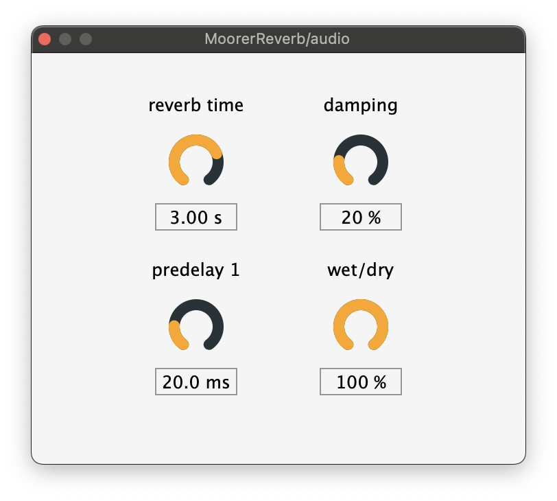

# Moorer's Reverb

In 1979, James A. Moorer built upon the work of Manfred R. Schroeder's design of the world's first artificial reverberation algorithm. Schroeder's design was simple, using only a bank of comb filters to generate early reflections and two allpass filters for the late, diffuse reflections. Moorer experimented with simulating early reflections by taking multiple delay taps out of the input signal, then summing those to be sent to both the output and a bank of comb filters and a single allpass. The comb and allpass filters rather generated the late reflections, and created a much more realistic simulation of reverberation in a real space.

Convolution is perhaps the most effective approach to simulating realistic reverb, but algorithm reverb even today remains as a tool for free creative manipulation of reverberated sound. Additionally, algorithmic reverb can be applied sample-by-sample, rather than having to wait on an FFT buffer to be filled like in convolution reverb.

The GUI is very minimal, with knobs for reverb time (an approximation of the length of the reverb tail), damping (high frequency rolloff), predelay (time before the first reflection), and wet/dry mix.

## Installation

1. Download and unzip the `.vst3` file in the [latest release](https://github.com/isaiahdoyle/moorerreverb/releases/tag/v0.9)
2. Locate your VST3 folder
    - MacOS default: `Library/Audio/Plugin-Ins/VST3`
    - Windows default: `C:\Program Files\Common Files\VST3`
3. Move/copy the unzipped `.vst3` file into the folder above

*note: this plugin has only been tested this on MacOS 14. it should be cross-platform to my knowledge (i.e., no mac-specific operations are used), but i've yet to experiment with cross-platform testing.*
